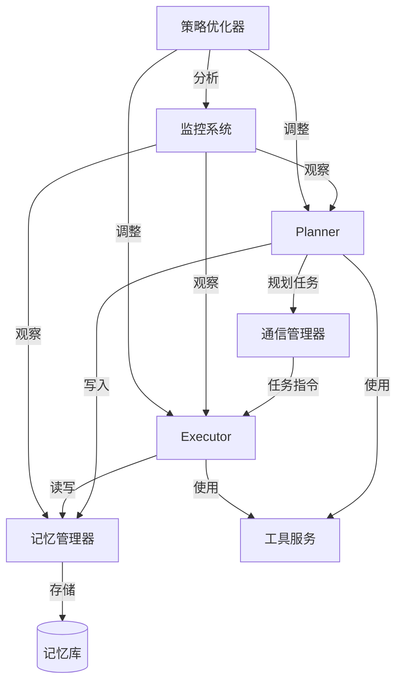

# 系统架构与模式

## 整体架构
系统采用分层架构设计，主要包含以下核心层次：
1. **智能体层**：由Planner和Executor两类主要智能体构成
2. **记忆管理层**：实现三维记忆拓扑（短期、中期、长期记忆）
3. **通信协议层**：提供结构化消息格式和可靠性保障
4. **工具集成层**：包含环境感知和动态LLM选择等工具
5. **自进化层**：实现实时性能分析和策略优化

整体架构遵循高内聚低耦合原则，各层之间通过标准化接口进行交互。

## 关键技术决策

1. **智能体角色分离**
   - 采用Planner-Executor模式，明确职责划分
   - Planner使用高智能模型（如SILICONFLOW的DeepSeek-R1）进行复杂任务规划
   - Executor实现自愈执行引擎，专注于任务执行和错误处理

2. **记忆系统选型**
   - 使用向量存储实现语义记忆检索
   - 采用LZ4压缩算法降低内存占用
   - 实现BERT嵌入进行高效语义搜索
   - 采用自适应保留策略管理记忆生命周期

3. **通信机制**
   - 基于JSON的结构化消息格式
   - 引入QoS (Quality of Service) 等级保障关键指令
   - 实现指数退避重试策略避免雪崩效应
   - 使用SHA3-256进行上下文校验

4. **LLM集成策略**
   - 基于任务复杂度动态选择适合的LLM
   - 低复杂度任务使用Claude-3-5-Sonnet
   - 中等复杂度任务使用GPT-4o
   - 高复杂度任务使用o1-128k

## 设计模式

1. **观察者模式**
   - 用于智能体健康监控系统
   - 实现资源使用、任务执行质量等指标的实时观察

2. **策略模式**
   - 用于动态LLM选择和错误处理
   - 根据任务特性和系统状态灵活切换策略

3. **命令模式**
   - 实现Planner向Executor发送任务指令
   - 支持任务的排队、撤销和重试操作

4. **适配器模式**
   - 用于集成不同的LLM提供商API
   - 提供统一接口访问不同的外部服务和工具

5. **工厂模式**
   - 用于创建和管理不同类型的智能体
   - 实现智能体的动态配置和实例化

## 组件关系

主要组件之间通过事件驱动模式实现松耦合集成，保证系统的可扩展性和灵活性。

*最后更新: 2025-05-08 12:23:45*
